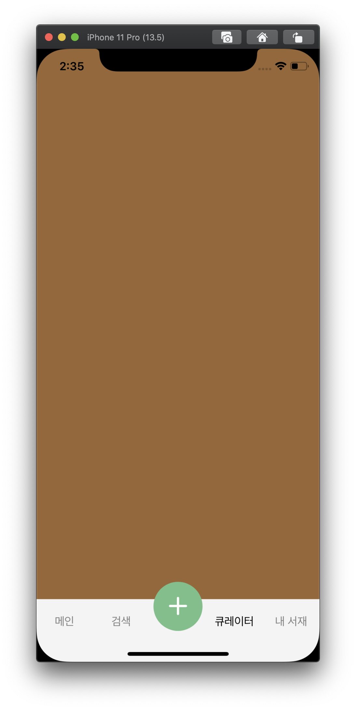
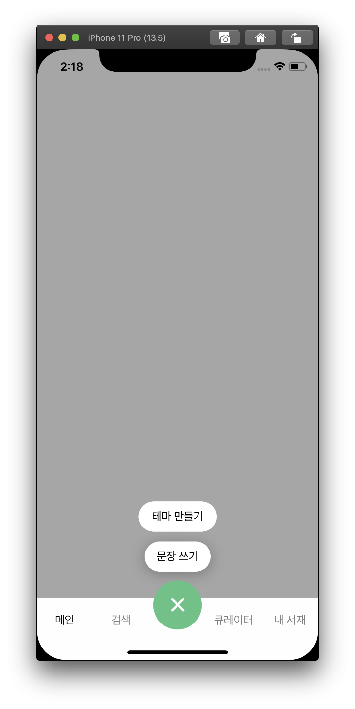
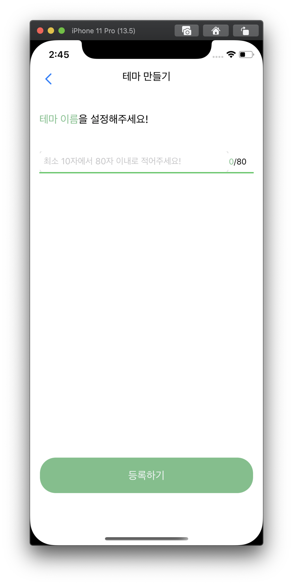
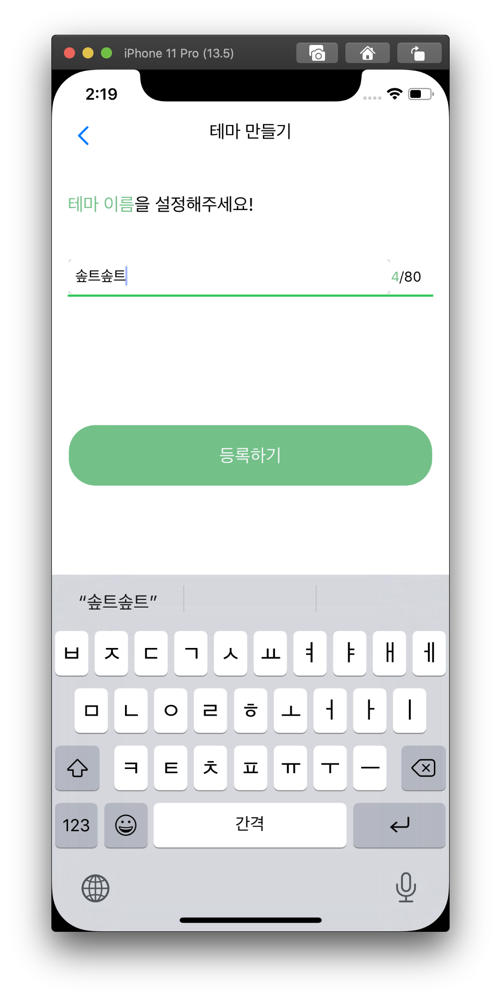
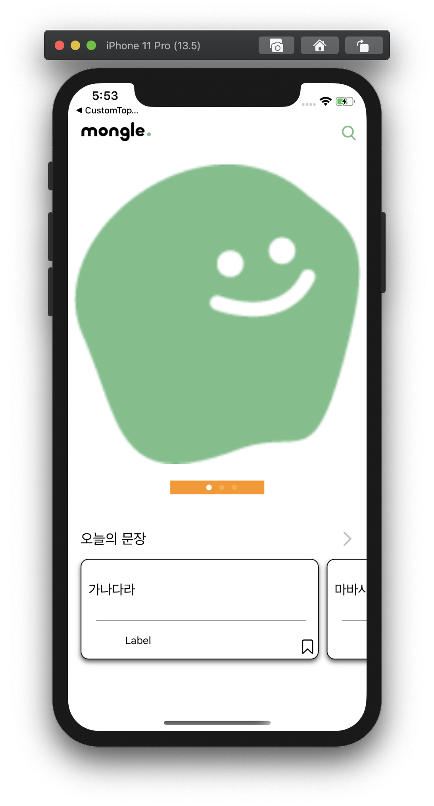
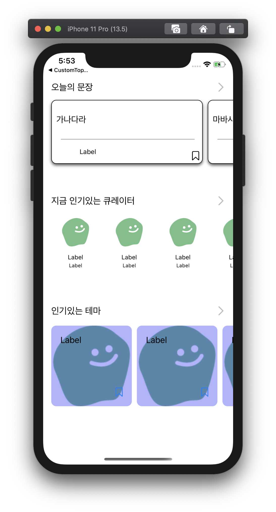
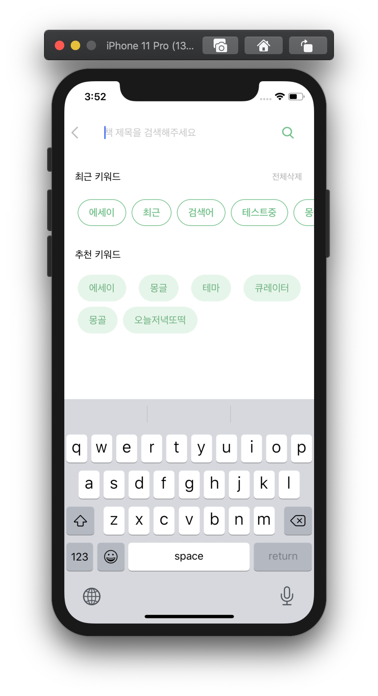
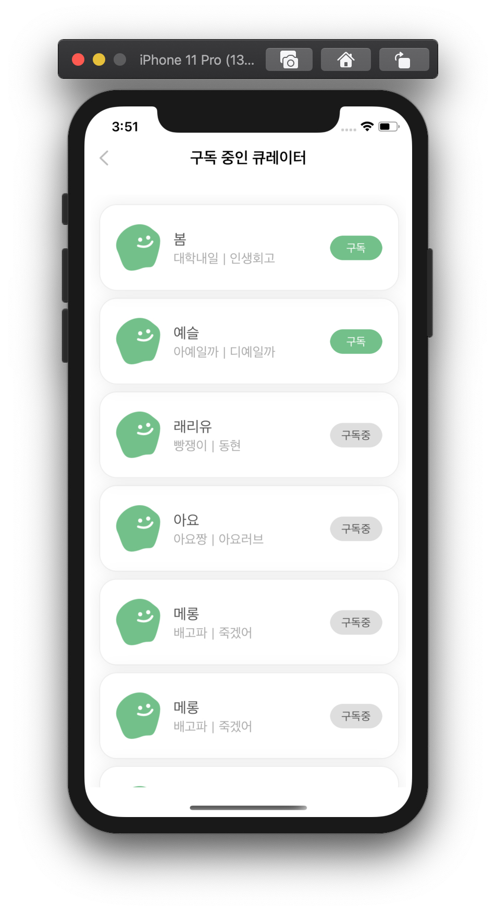

# 📚 Mongle


## Team Mongle-iOS 👨🏻‍💻🧑🏻‍💻👩🏻‍💻


- 김윤재 [qodhrkawk](https://github.com/qodhrkawk)
- 이예슬 [seu11ee](https://github.com/seu11ee)
- 이주혁 [Juhyeoklee](https://github.com/Juhyeoklee)

## 앱 아이콘


## Work-Flow

## 기능

### 탭바 커스텀

<p align=>

</p>



## 실행 화면 캡쳐

### 1. 로그인 / 회원가입




### 메인 화면



### 검색



### 큐레이터 리스트




## 기능 소개
|화면|기능 설명| 우선순위| 구현 여부 | 기타 사항 | 담당자
|---|---|-------|---|---|---|
|스플래시|앱 실행 시 애니메이션 실행|1순위| O | |김윤재| 
|회원가입|제출 전 올바른 입력인지 확인|1순위| O| |서 중복된 닉네임인지 확인|1순위| O| |김윤재|
| |중복 닉네임 확인| 1순위| O| |김윤재|
|로그인|로그인 기능|1순위| O| |김윤재|
|하단 탭바|하단 커스턴 탭바 + 플로팅 버튼|0순위| O| |김윤재|
|테마 만들기|테마 사진 선택(서버 연동)|0순위| O| |김윤재|
| |테마 작성 40자 제한|2순위| O| |김윤재|
| |잘못된 입력시 피드백 메시지 + 토스트|4순위| O| |김윤재|
| | 최종 제출 전 팝업|4순위| O| |김윤재|


## 📝 [Coding Convention Rule](./docs/CodingConventionRule.md)

## 🤝 [Team Rule](./docs/TeamRule.md)

## Dependencies

```
pod 'Alamofire', '~> 4.8.2'
pod 'Kingfisher', '~> 5.0'
pod 'SnapKit', '~> 5.0.0'
pod 'Then'`
pod 'Hero'
pod 'lottie-ios'
pod 'Gifu'


```
