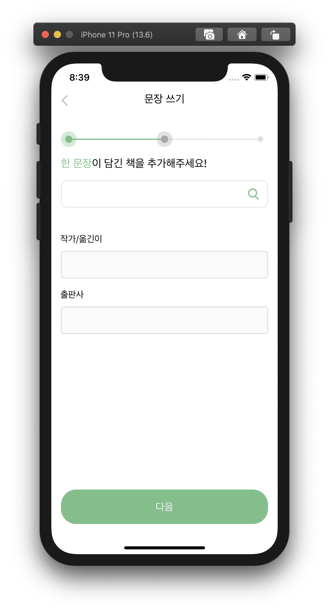
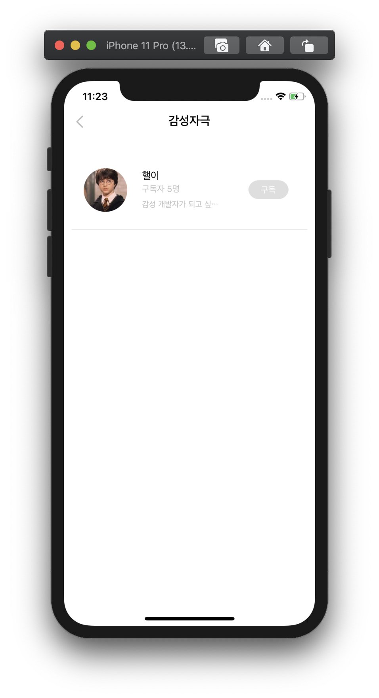

# 📚 Mongle


```
📌 책도 가볍게 즐길 수 없을까?

📌 책 속에 담겨있는 짧지만 강렬한 문장들은 우리에게 영감을 주기도 하고, 마음 속 커다란 울림을 주기도 합니다.

📌 몽글은 문장들에 호기심이 많고 감수성이 뛰어난 이들에게 새로운 문장공유 경험을 제공합니다.

📌 우리가 만드는 문장 큐레이션 플랫폼
```

<br>

## Team Mongle-iOS 👨🏻‍💻🧑🏻‍💻👩🏻‍💻


- 김윤재 [qodhrkawk](https://github.com/qodhrkawk)
- 이예슬 [seu11ee](https://github.com/seu11ee)
- 이주혁 [Juhyeoklee](https://github.com/Juhyeoklee)

## 앱 아이콘


## Work-Flow


## 실행 화면 캡쳐

### 스플래시
스플래시 애니메이션 이후 로그인 화면으로 넘어감


### 1-1. 로그인
키보드 나타날 때 화면이 위로 올라감. 올바르지 않은 입력 시 팝업창 나타남.


### 1-2. 회원가입
모든 텍스트 필드에 올바른 형식의 입력이 들어와야 서버와 통신 가능, 그렇지 않으면 warning 보여줌.


### 2. 메인 화면 플로우
오늘의 문장, 큐레이터, 추천 테마를 보여줌. 각각을 선택하면 상세 뷰로 넘어가고, 해당 테마/문장을 수정할 수 있음.


### 2-1. 문장 쓰기 화면

문장 작성하는 플로우.  원이 불이 들어오는 애니메이션과 프로그레스 바가 진행되는 애니메이션으로 진척도를 나타냄.




### 2-2. 테마 만들기 화면

테마 만들기. 테마 생성 직전 팝업을 보여줌.


### 3. 검색 화면

하나의 검색어로 테마, 문장, 큐레이터 검색 가능. 최근 키워드와 추천 키워드 제공


### 4. 큐레이터 화면

큐레이터 리스트를 보여주고, 추천 큐레이터도 보여줌. 큐레이터를 누르면 큐레이터 상세 뷰를 보여줌.





### 5. 내 서재 화면

저장한/작성한 테마,문장,큐레이터를 보여줌.


## 기능 소개


|담당자|화면|기능 설명| 우선순위| 구현 여부 | 
|:---:|:---:|:-------:|:---:|:---:|
|이주혁|메인 화면 | 메인 화면 구조 만들기 |0순위| O | 
| |  | 스와이프를 이용한 커스텀 탭바 전환 |3순위| O | 
| |  | 테마, 문장, 큐레이터 실시간으로 보여주기 |0순위| O | 
| | 테마 보기 | 테마 상세 정보 화면 |0순위| O | 
| | 문장 보기 | 문장 상세 정보 화면 |0순위| O | 
| |    | 문장 수정 화면 |0순위| O | 
| |  설정  | 회원 프로필 수정 |3순위| O | 
| |    | 앱 정보 화면 |3순위| O | 
| |    | 개발자 정보 화면 |3순위| O | 
| |    | 토스트 팝업 화면 |1순위| O | 
||||||
|이예슬|검색 | 테마 / 문장 /큐레이터 검색 기능 |0순위| O | 
| |  | 최근 키워드 / 추천 키워드 기능 |1순위| O | 
| |  | 검색 결과 창 스와이프로 이동 |3순위| O | 
| | 큐레이터 | 큐레이터 리스트 구현 |0순위| O | 
| |    | 큐레이터 서재 구현 |1순위| O | 
| |    | 추천 큐레이터 제시 |3순위| O | 
| |  내 서재  | 테마 - 생성/저장 테마 탭 구현 |0순위| O | 
| |    |문장 - 생성/저장한 문장 탭 구현 |0순위| O | 
| |    |구독한 큐레이터 탭 구현 |0순위| O | 
| |    |스와이프를 통한 탭바 전환 |2순위| O | 
||||||
|김윤재|스플래시 | 앱 실행 시 애니메이션 실행|1순위| O | 
||회원가입|정상적인 회원 가입 기능|1순위| O| 
||로그인|로그인 기능|1순위| O| 
||하단 탭바|하단 커스턴 탭바 + 플로팅 버튼|0순위| O| 
||테마 만들기|테마 사진 선택|0순위| O| 
|| |잘못된 입력시 피드백 메시지 + 토스트|3순위| O| 
|| | 최종 제출 전 팝업|3순위| O| 
||문장 쓰기| 글자 수 제한 실시간 피드백|0순위| O| 
|| | 책 검색 : Open API 사용|0순위| O| 
|| | 문장을 추가할 테마 선택 기능|0순위| O| 


## 어려웠던 기능 + 배운 점
### 1. 어려운 상단 탭바 구조

#### 어려운 점


#### 배운 점


### 2. 어려운 하단 탭바 구조

#### 어려운 점

몽글의 하단 커스텀 탭바는 탭바 위에 버튼이 하나 있고, 그 버튼이 눌리면 배경이 blur처리 되면서 회전을 하고, 두 가지 
서브 기능을 하는 버튼이 나타나야 함. 따라서 SnapKit을 활용해 버튼의 레이아웃을 잡고,  애니메이션을 통해 버튼의 회전을 
구현함. 이 버튼의 핵심 기능의 function은 아래와 같음.

```swift

    private func showSubMenus(){
           UIView.animate(withDuration: 0.25 , delay: 0, options: [.curveEaseIn], animations: {
               self.plusButton.transform = CGAffineTransform(rotationAngle: .pi/4)
               [self.blurView, self.makeThemeButton, self.writeSentenceButton].forEach{
                   $0.alpha = 1
                   if $0 != self.blurView {
                       $0.transform = CGAffineTransform(translationX: 0, y: -25)
                   }
               }
               
           },completion: nil)
           
           
       }

```
       

#### 배운 점
이 하단 탭바를 앱잼 초기에 구현했는데, 이 때 SnapKit과 Then, animation에 대해서 전반적으로 이해할 수 있었음.
특히 animation을 잘 이해하고 재미를 붙이게 되어서 이후 다양한 구현에 애니메이션을 수월하게 사용할 수 있었음.
예시로, 문장 쓰기 뷰에서 progress bar 애니메이션을 다음과 같이 구현할 수 있었음.

```swift

    func ballAppearAnimation(){
           UIView.animate(withDuration: 0.5 , delay: 0.25, options: [.curveEaseIn], animations: {
               self.innerCircle2.backgroundColor = .softGreen
               self.outerCircle2.backgroundColor = .softGreen
               
           }, completion:nil)
           
       }

    func secondLevelAnimation() {
          progressBar.progress = 0
          //        progressBar.setProgress(0.5, animated: true)
         
          
          UIView.animate(withDuration: 0.5, delay: 0.0, animations: {
              self.progressBar.layoutIfNeeded()
              
          }, completion: { finished in
              self.progressBar.progress = 0.5
             
              
              
              
              UIView.animate(withDuration: 0.75 , delay: 0.0, options: [.curveEaseIn], animations: {
                  self.progressBar.layoutIfNeeded()
              }, completion:nil)
          })
          
          
          
      }
      
```


<div align="center" style="display:flex;"></div>


### 3.  SnapKit 을 통한 Auto Layout

#### 어려운 점
SnapKit과 Then을 통해 수월하게 auto layout을 잡을 수 있었으나, 상수 값으로 layout을 잡을 떄 기기가 달라지면 비율이
깨지거나 위치가 너무 치우치는 상황이 발생했음. 

#### 배운 점

해당 문제를 해결하기 위해 다음과 같은 상수를 사용했음.
```swift

     let deviceBound = UIScreen.main.bounds.height/812.0
     
```
     

SnapKit을 이용해 코드로 잡아준 Layout은 주로 기기의 height 차이에 의해 발생하는데, 이를 해결하기 위해 위의 상수를
layout constant에 곱해주어 다른 기기에서 알맞게 작용하게 적용했음.


### 4. 서버 통신 중 nil값이 입력일 때 

#### 어려운 점

문제가 되었던 데이터 구조는 아래와 같음. 잘 되던 통신이 갑자기 되지 않아 당황하고 한참 이유를 찾았는데,
알고보니 문장 작성에서 '테마 없는 문장'을 선택하고 post하고 난 뒤  테마를 서버에서 get할 때,  writerImg가 nil로
들어와서 에러가 나는 상황이었음.

```swift

    struct ThemeSelectForWriteData : Codable {
        
        let themeIdx: Int
        let theme, themeImg: String
        let themeImgIdx, saves: Int
        let writer, writerImg: String
        let alreadyBookmarked: Bool
     
    }

따라서 위의 구조에서 writerImg를 optional로 바꿔주니 해결되는 문제였음

    struct ThemeSelectForWriteData : Codable {
           
           let themeIdx: Int
           let theme: String
           let themeImg: String
           let themeImgIdx, saves: Int
           let writer : String
           let writerImg: String?
           let alreadyBookmarked: Bool
        
       }
       
```


#### 배운 점 


서버와의 통신 과정에서 optional 처리가 매우 중요하다는 것을 알게 되었음. 이후에 비슷한 에러를 수차례 만나게 되었고,
처음 이 에러에 직면했을 때엔 해결하는 데 많은 시간이 걸렸지만 이후에는 쉽게 해결할 수 있었음.
이후에 nil 값이 들어올 수 있는 데이터는 optional 처리를 해주기로 함.


### 5. body 가 있는 get

#### 어려운 점
서버 통신 과정에서 API 문서에 get에 body가 있는 경우가 있었음. 서버와의 소통을 통해 body를 query 형식으로 
바꿔 달라고 요청했고, 이를 통해 query를 이용해 통신할 수 있었음. 해당하는 서비스 코드는 다음과 같음. 


```swift

    static let shared = BookSearchForWritingService()
      
      private func makeParameter(_ title : String)-> Parameters{
          return ["query" : title]
      }
      
      func bookSearch(title : String, completion : @escaping (NetworkResult<Any>) -> Void){
          let header : HTTPHeaders = ["Content-Type" : "application/json"]
          
          
          let dataRequest = Alamofire.request(APIConstants.bookSearchForWritingURL,
                                              method: .get,
                                              parameters: makeParameter(title),
                                              encoding: URLEncoding.default,
              headers: header)
          
          
          
          dataRequest.responseData { dataResponse in
              switch dataResponse.result {
              case .success :
                  
                  guard let statusCode = dataResponse.response?.statusCode else {return}
                  guard let data = dataResponse.value else {return}
                  let networkResult = self.judge(by: statusCode, data)
                  completion(networkResult)
                  
              case .failure(let err):
                  print(err)
                  completion(.networkFail)
                  
                  
              }
              
              
          }
      }
    
```

#### 배운 점 
query string이라는 새로운 통신 방법을 배울 수 있었음. 


## 📝 [Coding Convention Rule](./docs/CodingConventionRule.md)

## 🤝 [Team Rule](./docs/TeamRule.md)


## People

### 이주혁
빛 아요 리드개발자 . 차기 아요 팟장

### 이예슬

### 김윤재 


## Dependencies

```
pod 'Alamofire', '~> 4.8.2'
pod 'Kingfisher', '~> 5.0'
pod 'SnapKit', '~> 5.0.0'
pod 'Then'`
pod 'Hero'
pod 'lottie-ios'
pod 'Gifu'


```

<div align="right" style="display:flex;"></div>
