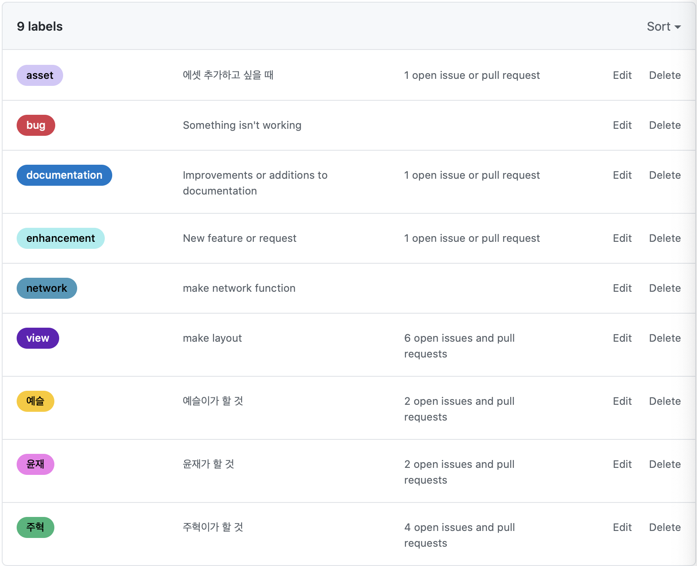

## TeamRule

### Foldering Rule

```swift
Project
ㄴResource
	ㄴ Assets.xcassets
	ㄴ Storyboard
	ㄴ APIService
	ㄴ Xibs
ㄴSource
	ㄴ Views
	ㄴ Model
	ㄴ Extensions
	ㄴ Cell
	ㄴ VCs
ㄴ SceneDelegate.swift
ㄴ AppDelegate.swift
ㄴ Info.plist
```

### Github issue Rule

#### issue name

- [view] 화면이름 : 화면 레이아웃, 인터렉션
- [network] 화면이름 : 서버통신
- [bug] 화면 이름 : 화면 구현 이후에 다시 수정할 버그가 생긴 경우
- [enhance] : 화면 구현 완료 이후에 추가적인 기능을 하는 경우
- [asset] : 에셋 추가할때
  - 이슈 내용에 에셋 필요한 거 잘 적어 두기
- [docs] : 문서 추가할 때

#### project

- 이슈 생성하고, Assignee, Project 꼭 할당해주기

### Issue label Rule

- view, network, bug, enhancement, asset, documentation. 주혁, 예슬, 윤재,



### Git Branch Strategy

#### master branch

안정화된 develop 상태, 주기적으로 develop과 merge

#### develop branch

feature 브랜치에서 각 기능이 추가되는 branch

#### feature branch

- feature/#이슈번호 형태로 브랜치 생성
- develop에 합칠 branch, 각 이슈마다 브랜치를 만들어서 기능이 완료될 때 develop branch로 pull request 생성 → 관리자는 직접 merge 확인 후 pull request 를 merge

### Git Commit Message Rule

- [CREATE] ...
- [UPDATE] ...
- [DELETE] ...

> 뒤에는 잘 알아볼 수 있도록 설정
> 궁둥이 땔 때 마다 커밋하는 습관을 들이자 !
